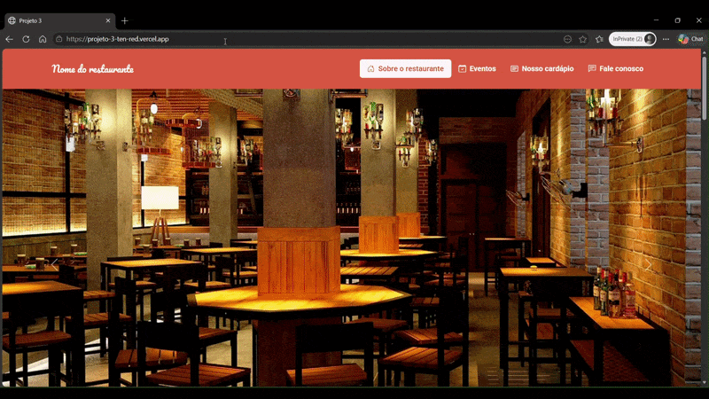

<div align="center">
  
</div>

# 🍽️ Página de Restaurante

[](https://github.com/gugainglez2/projeto_3)
[](https://github.com/gugainglez2/projeto_3)

Uma landing page institucional genérica moderna, elegante e totalmente responsiva desenvolvida para um restaurante. O projeto foi projetado com foco em usabilidade, hierarquia visual clara e apresentação atraente do menu e do espaço.

> 🎓 **Projeto Acadêmico:** Desenvolvido como parte prática da formação frontend da **EBAC (Escola Britânica de Artes Criativas e Tecnologia)**.

---

## 🚀 Tecnologias Utilizadas

O desenvolvimento priorizou o uso de tecnologias limpas e estruturas consolidadas do mercado:

* **HTML5** – Estruturação semântica avançada (uso correto de `section`, `article`, `header`, `footer`) para melhor acessibilidade e indexação (SEO).
* **CSS3 Avançado** – Construção de layout utilizando os sistemas modernos de **Flexbox** e **CSS Grid** para distribuição flexível dos elementos.
* **Google Fonts & Font Awesome** – Integração de tipografia refinada e ícones vetoriais leves para enriquecer a identidade visual.

---

## ✨ Funcionalidades e Diferenciais

* **Navegação Inteligente (Sticky Header):** Menu superior fixo que facilita o deslocamento do usuário pelas seções da página.
* **Galeria e Menu Visual:** Exposição dos pratos e bebidas organizada em grids simétricos, mantendo a sofisticação visual do estabelecimento.
* **Design Totalmente Responsivo:** Implementação de `@media screen` com breakpoints estratégicos para garantir que a experiência de visualização seja impecável tanto em telas desktop quanto em tablets e smartphones.
* **Formulário de Contato e Localização:** Área dedicada para engajamento do cliente, incluindo mapa ou informações estruturadas para reserva.

---

## 🛠️ Como Executar o Projeto Localmente

Como o projeto foi desenvolvido com tecnologias nativas da web (HTML/CSS), executá-lo é extremamente simples e não requer gerenciadores de pacotes pesados.

### Passo a Passo

1. **Clonar o repositório:**
   ```bash
   git clone https://github.com/gugainglez2/projeto_3.git
Acessar o diretório do projeto:

Bash
cd projeto_3
Abrir a aplicação:

Basta dar um duplo clique no arquivo index.html para abri-lo diretamente no seu navegador de preferência.

Alternativa: Se você utiliza o VS Code, pode iniciar a extensão Live Server para rodar o projeto em um servidor local dinâmico ([http://127.0.0.1:5500](http://127.0.0.1:5500)).

📂 Estrutura de Pastas
Plaintext
projeto_3/
├── images/        # Banco de imagens otimizadas do restaurante e pratos
├── main.css       # Folha de estilos contendo reset, variáveis e media queries
├── index.html     # Estrutura e conteúdo semântico da página principal
└── README.md      # Documentação do projeto

🧠 Principais Aprendizados (EBAC)
Design Responsivo Root: Domínio de técnicas de responsividade sem a necessidade de frameworks (como Bootstrap), utilizando apenas CSS puro para entender profundamente o comportamento dos elementos na tela.

Hierarquia Visual: Aplicação prática de conceitos de contraste, espaçamento (padding/margin) e tipografia voltados à conversão de usuários para o segmento de alimentação.
